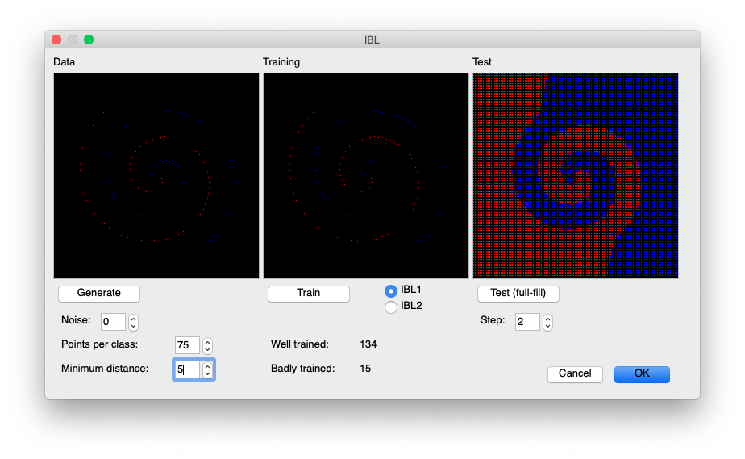
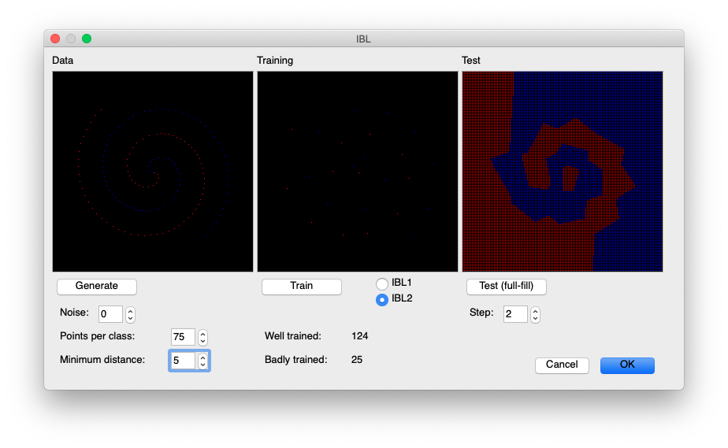
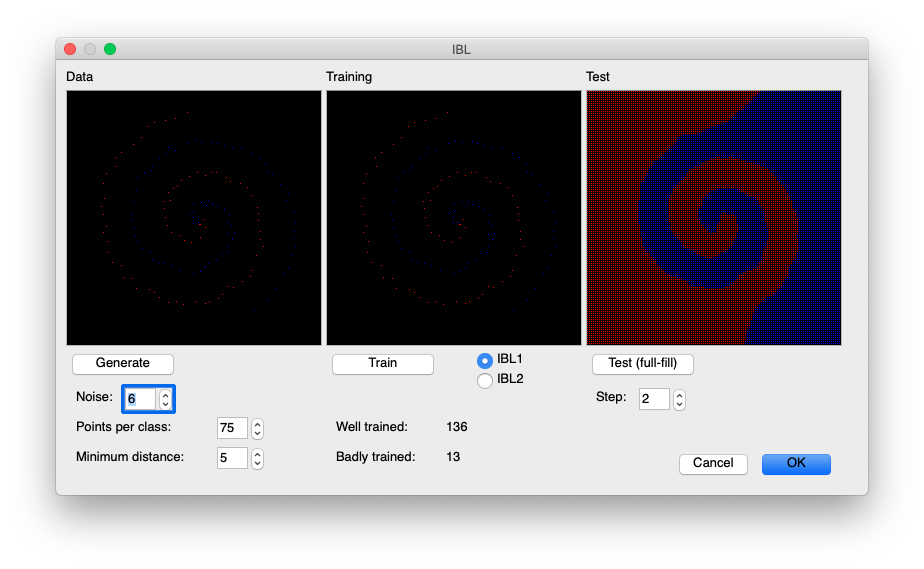
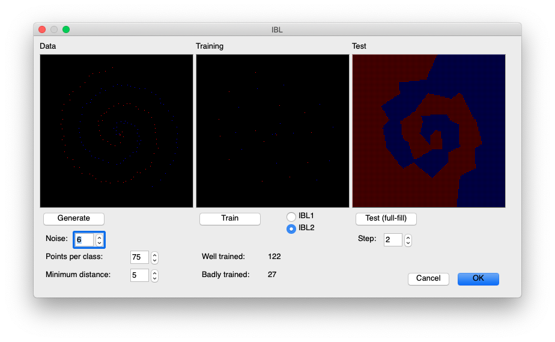

# ibl
This is a Instance-Based Learning (IBL) tool, implementing IB1 and IB2 algorithms.
Input data used is always a generated double spiral (with or without noise). Instances are pixels from each spiral class.
* IB1 store every instance
* IB2 store only badly classified instances (because the other instances do not distinguish where the concept
boundary lies).

After, the trained dataset can be used to test unknown data. As this tools is dealing with pixel position (near or far from each spiral class), we can test any random pixel to check where it belongs to.


# Authors
Luiz Eduardo Pizzinatto

&

Bruno Martins Crocomo

# Execution
To execute, type in terminal:

```
python Main.py
```

First, generate an input data (a double spiral). Parameters are:
* Noise - random noise in each pixel. Zero is a perfet double spiral
* Points per class - how many pixels each class should have.
* Minimum distance - minimum distance between each pixel inside each class

Then, train a new dataset with IB1 or IB2 algorithms. Are shown only those instances used in the created training dataset (IB1: all instances, IB2: only badly trained ones).

Also, you can test unseen data against this training dataset with the last button. This process check every pixel and mark its result class in the last image. As this process can be slow, `step` value is used to step pixel during check.


# Examples
Generating a double spiral with zero noise, 75 instances per class and 5 pixels as minimum distance, choosing IB1 as training algorithm, give this:


And with same parameters, but selecting IB2 algorithm:


Using some noise and IB1:


Using some noise and IB2:



# Infos
* _Euclidean distance_ measure is used in both IBL implementations.
